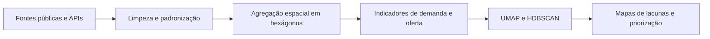
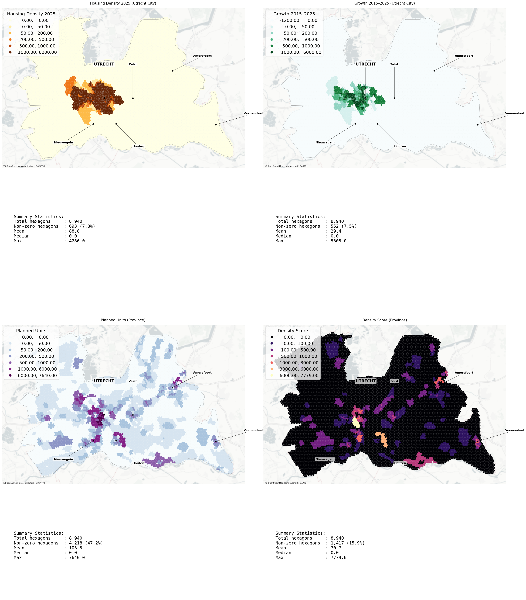
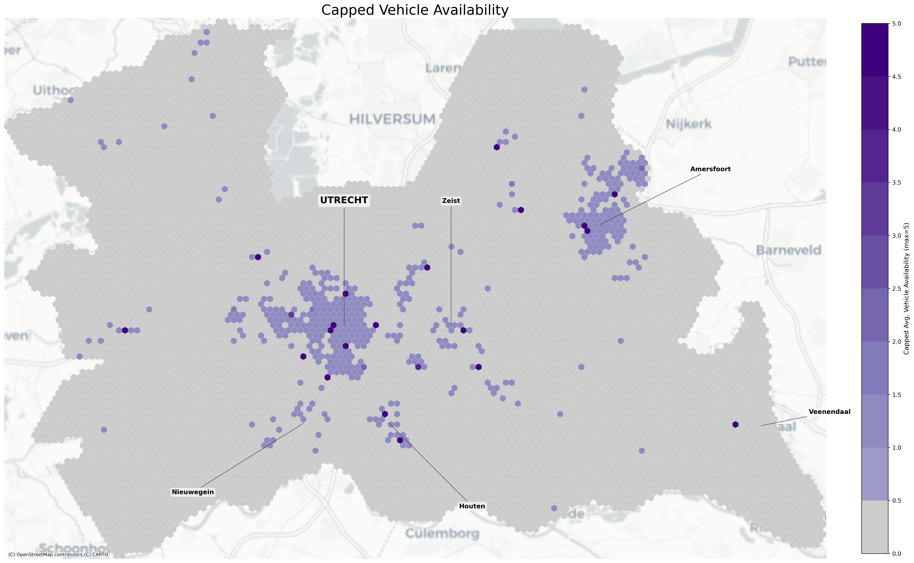
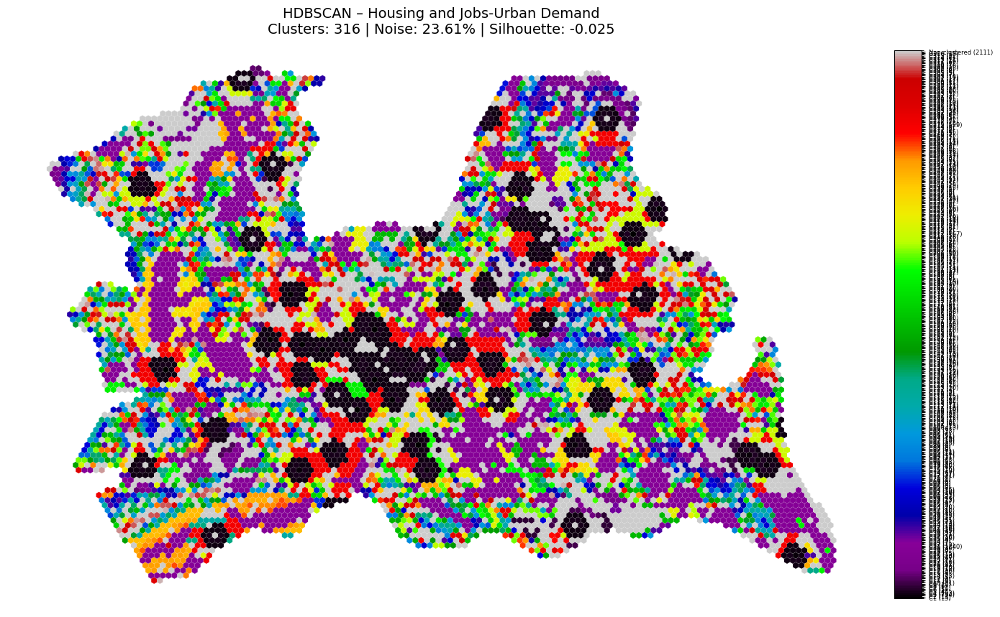
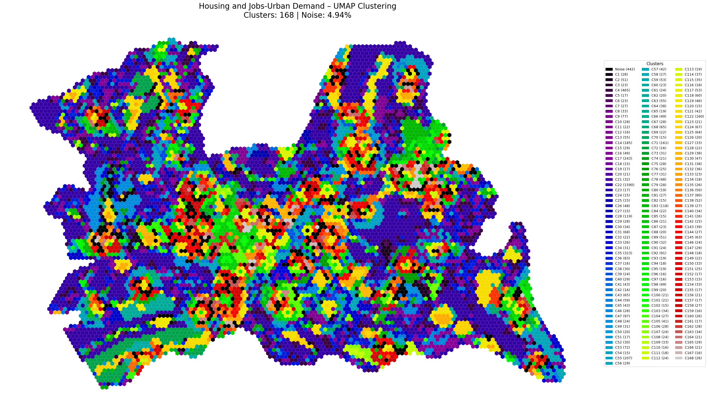
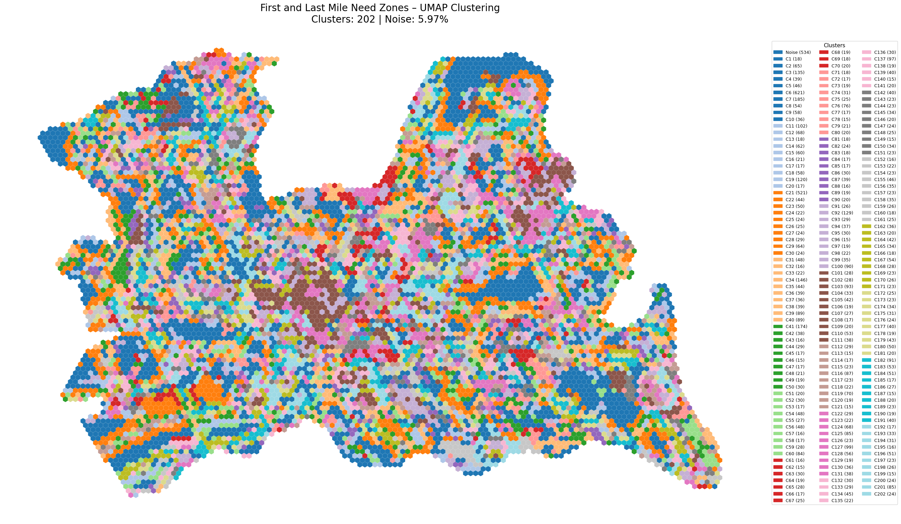
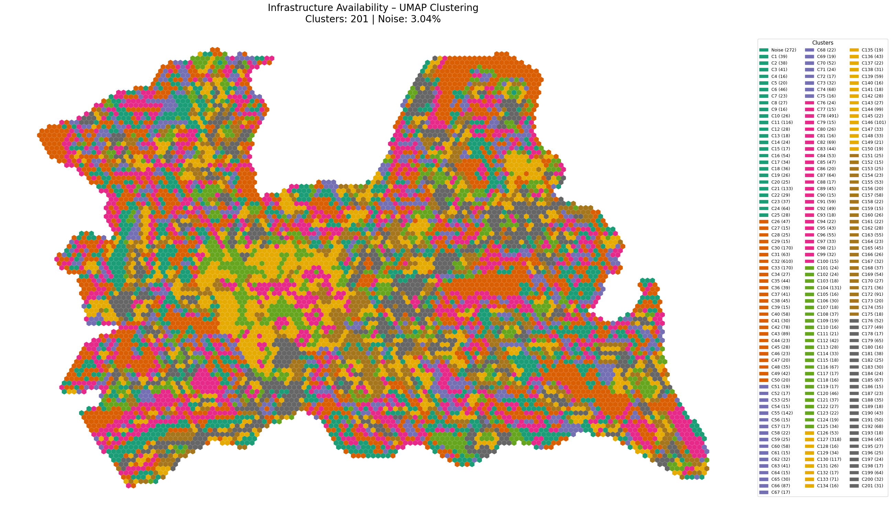
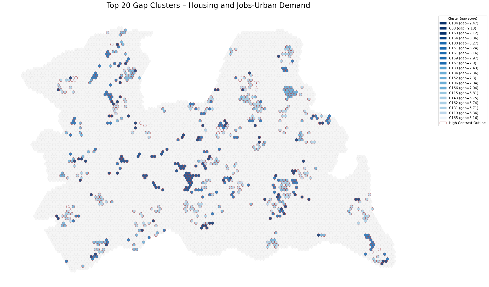
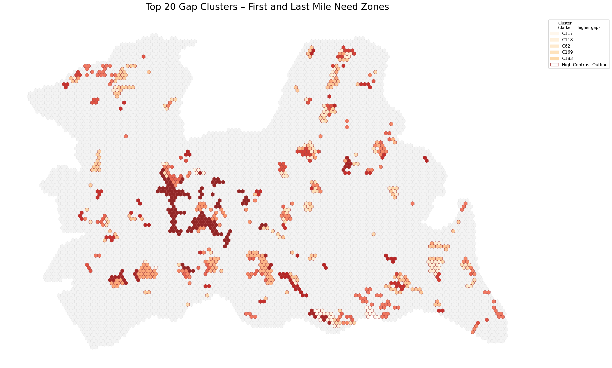

# Utrecht · Hubs de mobilidade e lacunas territoriais

Relatório resumido em português-BR do projeto **Utrecht Mobility Hub Analysis**.

## Pergunta central

Onde reforçar ou implantar hubs de mobilidade na Província de Utrecht para responder ao crescimento da demanda e melhorar o acesso multimodal.

## Síntese do projeto

O estudo cruza demanda urbana, moradia, empregos, transporte público, shared mobility e hubs existentes em uma grade hexagonal de 250 metros. A partir dessas camadas, o projeto identifica áreas com desequilíbrio entre cobertura de infraestrutura e pressão de demanda.

**Relatório completo em PDF:** [3.0_report/Utrecht_Mobility_Hub_Analysis_Full_Report.pdf](3.0_report/Utrecht_Mobility_Hub_Analysis_Full_Report.pdf)

## Método



### Etapas do pipeline

| Etapa | O que foi feito |
|---|---|
| Grade espacial | O território foi organizado em hexágonos de 250 m, criando uma unidade comparável para toda a província. |
| Demanda | Foram agregados empregos ponderados por modo de trabalho, densidade habitacional, crescimento e unidades planejadas. |
| Oferta | Foram integrados hubs existentes, transporte público, OV-fiets e disponibilidade de veículos compartilhados. |
| Features | As variáveis foram transformadas em scores, logs e flags para reduzir assimetria e tornar os indicadores comparáveis. |
| Modelagem | Os dados passaram por `RobustScaler`, depois por redução de dimensionalidade com UMAP e clustering com HDBSCAN. |
| Priorização | A leitura final combina clusters e `gap scores` para identificar áreas com maior pressão de demanda e menor cobertura de infraestrutura. |

### Features e engenharia analítica

As features foram organizadas em cinco grupos principais:

| Tema | Variáveis principais |
|---|---|
| Empregos | `job_weighted` e versão logarítmica |
| Moradia | densidade 2025, crescimento absoluto, unidades planejadas, logs e flags |
| Shared mobility | disponibilidade média, versões cap/log e acesso a OV-fiets |
| Hubs | distância aos hubs, tipo do hub e `hub_overall_score` |
| Transporte público | distância à rede e `pt_access_score` |

Essas variáveis não entram brutas no modelo. Parte delas é transformada para:

- reduzir distorções causadas por extremos;
- tornar unidades diferentes comparáveis;
- separar intensidade, proximidade e presença/ausência;
- preparar o conjunto para segmentação territorial.

### Machine learning

O projeto usa machine learning não para previsão, mas para **segmentação espacial**.

1. `RobustScaler`
   Normaliza as variáveis sem deixar outliers dominarem o conjunto.

2. `UMAP`
   Reduz a dimensionalidade para preservar padrões territoriais complexos em um espaço menor, facilitando leitura e clusterização.

3. `HDBSCAN`
   Identifica agrupamentos espaciais sem forçar número fixo de clusters. Áreas sem padrão consistente permanecem como `noise/outliers`, o que é útil para ler zonas de transição ou comportamento anômalo.

### Três conjuntos de clustering

O clustering foi rodado em três lentes analíticas diferentes:

| Conjunto | Lente | Exemplo de leitura |
|---|---|---|
| Demanda urbana | pressão de moradia e emprego versus hubs | onde crescimento e atividade superam a infraestrutura existente |
| Primeira / última milha | lacunas multimodais locais | onde faltam conexões finas entre rede principal e destino final |
| Disponibilidade de infraestrutura | redes parciais e cobertura média | onde faz sentido expandir ou integrar hubs intermediários |

### Gap score

O `gap score` é a lógica que transforma demanda e oferta em priorização. Em termos simples, ele compara pressão territorial com cobertura de infraestrutura.

Exemplo de raciocínio usado no conjunto de demanda:

```text
(emprego_log + moradia_log) / hub_score
```

Ou seja:

- quanto maior a pressão de moradia e emprego;
- e quanto menor a cobertura por hubs;
- maior a prioridade territorial da área.

## Bases utilizadas

- moradia e crescimento habitacional;
- empregos ponderados por modo;
- transporte público;
- hubs existentes;
- OV-fiets e shared mobility;
- rede cicloviária.

## Mapas principais

### Empregos ponderados


### Moradia e crescimento



### Shared mobility



### Acesso ao transporte público


## Clustering e leitura espacial

As imagens abaixo mostram exemplos dos agrupamentos gerados por UMAP + HDBSCAN.

<p align="center">
  
  
  
</p>
<p align="center">
  
  
  
</p>

Leitura geral:

- núcleos já bem servidos aparecem com padrões mais estáveis;
- periferias e franjas de crescimento revelam maior desequilíbrio;
- áreas classificadas como `noise` ajudam a localizar transições e situações fora do padrão dominante.

## Resultados

- identificação de áreas com cobertura mais frágil;
- leitura territorial de lacunas de mobilidade;
- priorização de zonas críticas;
- apoio a planejamento de hubs e integração modal.

## Relevância

Mobilidade sustentável, transporte público, acessibilidade urbana, análise espacial e visualização territorial.

## Estrutura do repositório

- `2.0_notebooks/` notebooks e mapas gerados;
- `3.0_report/` relatório completo em PDF;
- `requirements.txt` dependências do projeto.

## Ver arquivos do projeto

[Abrir repositório completo](https://github.com/Manoela-Calabresi-Portfolio/Utrecht-Mobility-Hub-Analysis)
