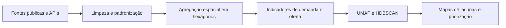

# Utrecht · Hubs de mobilidade e lacunas territoriais

Relatório resumido em português-BR do projeto **Utrecht Mobility Hub Analysis**.

## Pergunta central

Onde reforçar ou implantar hubs de mobilidade na Província de Utrecht para responder ao crescimento da demanda e melhorar o acesso multimodal.

## Síntese do projeto

O estudo cruza demanda urbana, moradia, empregos, transporte público, shared mobility e hubs existentes em uma grade hexagonal de 250 metros. A partir dessas camadas, o projeto identifica áreas com desequilíbrio entre cobertura de infraestrutura e pressão de demanda.

**Relatório completo em PDF:** [3.0_report/Utrecht_Mobility_Hub_Analysis_Full_Report.pdf](3.0_report/Utrecht_Mobility_Hub_Analysis_Full_Report.pdf)

## Método

## Bases utilizadas

- moradia e crescimento habitacional;
- empregos ponderados por modo;
- transporte público;
- hubs existentes;
- OV-fiets e shared mobility;
- rede cicloviária.

## Mapas principais

### Empregos ponderados

### Moradia e crescimento

### Shared mobility

### Acesso ao transporte público

## Resultados

- identificação de áreas com cobertura mais frágil;
- leitura territorial de lacunas de mobilidade;
- priorização de zonas críticas;
- apoio a planejamento de hubs e integração modal.

## Relevância

Mobilidade sustentável, transporte público, acessibilidade urbana, análise espacial e visualização territorial.

## Estrutura do repositório

- `2.0_notebooks/` notebooks e mapas gerados;
- `3.0_report/` relatório completo em PDF;
- `requirements.txt` dependências do projeto.

## Ver arquivos do projeto

[Abrir repositório completo](https://github.com/Manoela-Calabresi-Portfolio/Utrecht-Mobility-Hub-Analysis)
