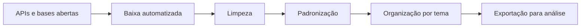

# ETL de geodados · infraestrutura para bases territoriais

**Repositório original:** https://github.com/Manoela-Calabresi-Portfolio/ETL-Geodata-Pipeline

Pipeline reprodutível para baixar, limpar, padronizar e organizar bases geoespaciais abertas para uso em mapas, indicadores e análises territoriais.

## O que este caso mostra

- como reduzir o trabalho manual com bases públicas;
- como transformar fontes dispersas em camadas utilizáveis;
- como criar uma base técnica comum para outros estudos.

## Fluxo

## Bases utilizadas

- APIs territoriais;
- camadas geoespaciais abertas;
- dados administrativos;
- formatos vetoriais reutilizáveis.

## Entregas

- bases tratadas;
- camadas georreferenciadas;
- estrutura reprodutível;
- insumos para mapas e indicadores.

## Ferramentas

Python · GeoPandas · DuckDB · ArcGIS REST API

## Relevância

Dados secundários, georreferenciamento, organização de bases públicas e infraestrutura analítica territorial.
