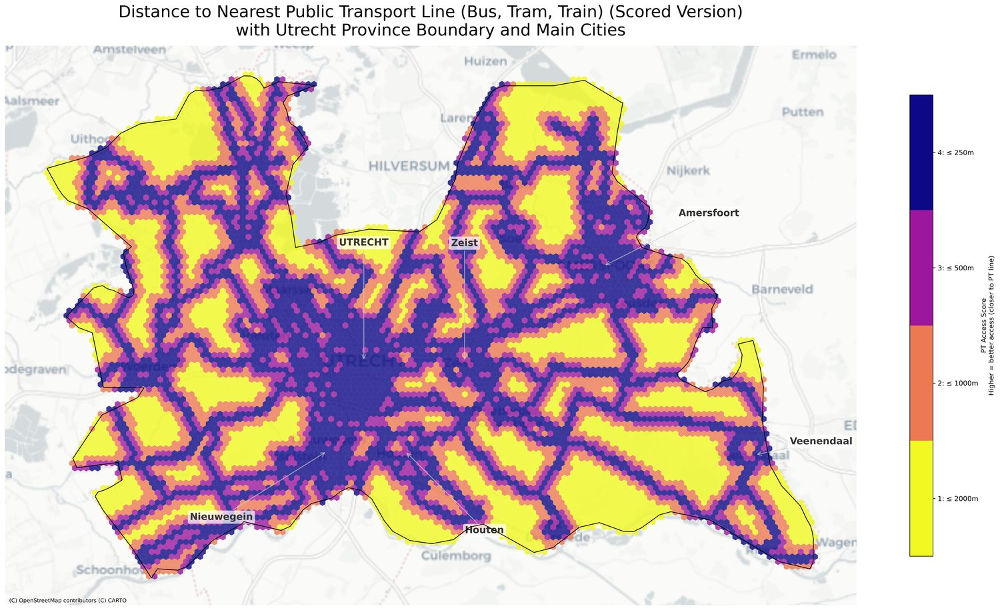

# Utrecht · Hubs de mobilidade e lacunas territoriais

**Repositório original:** https://github.com/Manoela-Calabresi-Portfolio/Utrecht-Mobility-Hub-Analysis

Estudo espacial sobre mobilidade compartilhada, acesso ao transporte público e cobertura territorial na Província de Utrecht.

## O que este caso mostra

- onde a cobertura de mobilidade é mais frágil;
- onde demanda e infraestrutura estão mais desequilibradas;
- como transformar dados de mobilidade em leitura territorial clara.

## Bases utilizadas

- transporte público;
- shared mobility;
- moradia e empregos;
- grade hexagonal e camadas territoriais.

## Método

## Entregas

- mapas temáticos;
- leitura de acessibilidade;
- score de lacunas;
- síntese para planejamento.

## Ferramentas

Python · GeoPandas · QGIS · UMAP · HDBSCAN

## Relevância

Mobilidade sustentável, transporte público, acessibilidade urbana e análise espacial aplicada.
